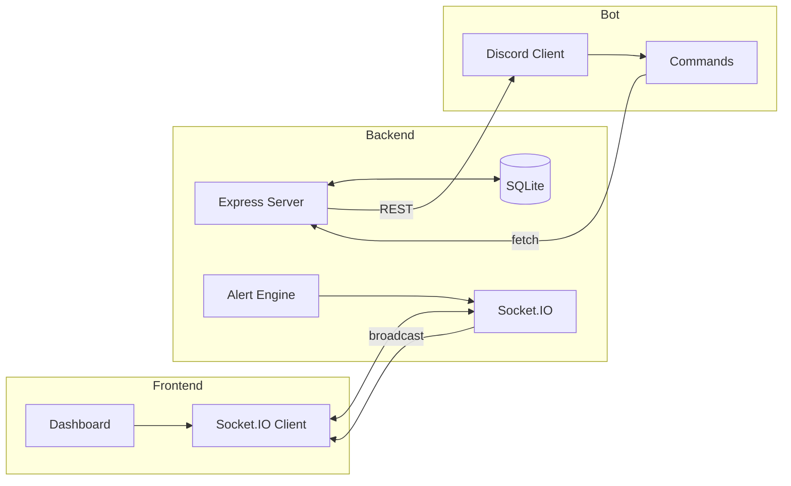

<p align="center">
  
</p>

<p align="center">
  
  
  
  
  
</p>

---

## Features

- **Live Dashboard** — Glass-morphism UI with real-time WebSocket updates, floor plan, and device toggles
- **Discord Bot** — Query device status, room details, and power usage directly from Discord
- **Alert Engine** — Detects after-hours usage and devices left ON for extended periods
- **SQLite Persistence** — Device state, usage history, and audit logs survive restarts

---

## Architecture



---

## Quick Start

```bash
git clone https://github.com/tayyab011/Teckathon-round1.git
cd Teckathon-round1
npm install
cp env.example .env
npm run dev
```

Open http://localhost:5000

---

## Discord Bot

| Command | Description |
|---------|-------------|
| `!status` | Show all rooms with device counts and total power |
| `!room <name>` | Show devices in a specific room |
| `!usage` | Show power consumption breakdown |

Room aliases: `drawing`, `work1`, `work2`

### Setup

1. Create app at [discord.com/developers/applications](https://discord.com/developers/applications)
2. Enable **Message Content Intent** under Bot settings
3. Copy token to `.env`: `DISCORD_BOT_TOKEN=your_token`
4. Generate invite URL under OAuth2 → URL Generator (scopes: `bot`, permissions: `Send Messages` + `Read Message History`)

---

## API

| Method | Endpoint | Description |
|--------|----------|-------------|
| GET | `/api/devices` | All devices with current status and power |
| GET | `/api/devices/room/:room` | Devices filtered by room |
| POST | `/api/devices/:id/toggle` | Toggle device ON/OFF |
| GET | `/api/usage` | Total power, kWh estimate, per-room breakdown |
| GET | `/api/alerts` | Unresolved alerts |
| GET | `/api/logs?limit=100` | Device toggle history |

---

## Project Structure

```
server.js           Express + Socket.IO + SQLite backend
discord-bot.js      Discord bot with command handlers
package.json        Dependencies and scripts
env.example         Environment variable template
public/index.html   Dashboard frontend
```

---

## Tech Stack

| Layer | Technology |
|-------|------------|
| Backend | Node.js, Express, Socket.IO |
| Database | SQLite (better-sqlite3) |
| Frontend | Vanilla JS, CSS glass-morphism |
| Bot | discord.js v14 |
| Process | concurrently |
