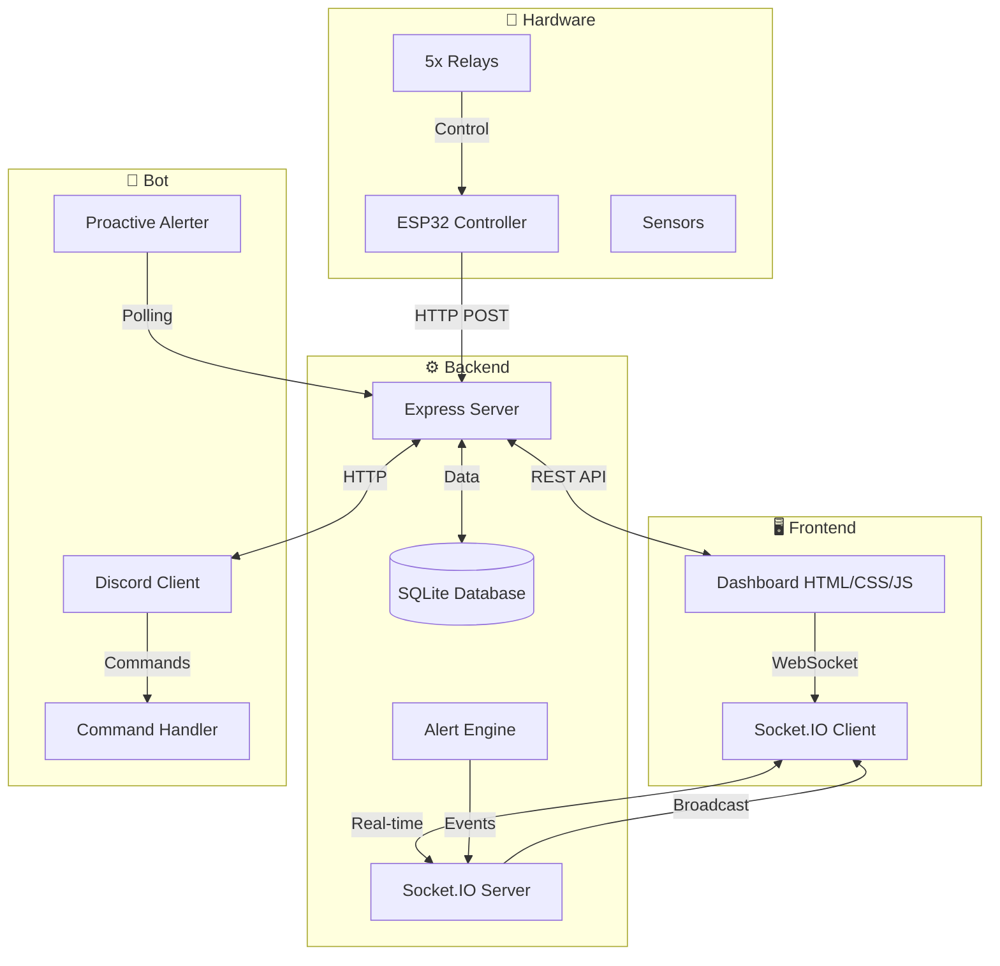

<div align="center">


<br>

[](LICENSE)
[](https://nodejs.org)
[](https://socket.io)
[](https://discord.js.org)
[](https://sqlite.org)
[](https://expressjs.com)

<br>

<!-- Animated Gradient Divider -->


</div>

<br>

<!-- Animated Feature Cards -->
<div align="center">

```ascii
╔═══════════════════════════════════════════════════════════════╗
║                                                               ║
║   🏢  Real-time Office Device Simulator & Monitoring System   ║
║                                                                 ║
║   ┌──────────────┐  ┌──────────────┐  ┌──────────────┐      ║
║   │  🖥 Dashboard │  │  🤖 Discord │  │  ⚡ WebSocket│      ║
║   │  Glass UI     │  │  Bot Control │  │  Real-time   │      ║
║   └──────────────┘  └──────────────┘  └──────────────┘      ║
║                                                               ║
╚═══════════════════════════════════════════════════════════════╝
```

</div>

<br>

---

## 📋 Table of Contents

- [✨ Features](#-features)
- [🏗 System Architecture](#-system-architecture)
- [🖥 Dashboard Preview](#-dashboard-preview)
- [🚀 Quick Start](#-quick-start)
- [🎮 Discord Bot Commands](#-discord-bot-commands)
- [📡 API Reference](#-api-reference)
- [📁 Project Structure](#-project-structure)
- [🛠 Tech Stack](#-tech-stack)
- [🔌 Hardware Schematic](#-hardware-schematic)
- [📄 License](#-license)

---

## ✨ Features

<div align="center">

| Feature | Description | Status |
|---------|-------------|--------|
| 🖥 **Live Dashboard** | Glass-morphism UI with real-time WebSocket updates | ✅ |
| 🔄 **Manual Toggle** | iOS-style toggle switches for each device | ✅ |
| 📊 **Power Monitoring** | Per-room wattage, total load, ring meter | ✅ |
| 🗺 **Floor Plan** | Visual room layout with device status dots | ✅ |
| 🤖 **Discord Bot** | `!status`, `!room`, `!usage` commands | ✅ |
| ⚠️ **Alert Engine** | After-hours + long-ON detection | ✅ |
| 💾 **SQLite Persistence** | Usage tracking, logs, device state | ✅ |
| 🚫 **No Flicker** | DOM-patching architecture, no full re-renders | ✅ |
| 🎨 **Dark Theme** | Liquid-glass aesthetic with ambient glow | ✅ |

</div>

<br>

<!-- Animated Features Grid -->
<div align="center">

```ascii
┌─────────────────────────────────────────────────────────────────┐
│                                                                 │
│   ⚡ Real-time WebSocket updates     🤖 Discord bot integration │
│                                                                 │
│   🎨 Glass-morphism UI                📊 Live power analytics   │
│                                                                 │
│   🗺️ Interactive floor plan           ⚠️ Smart alert engine     │
│                                                                 │
│   💾 SQLite-backed persistence        🔌 Hardware-ready I/O     │
│                                                                 │
└─────────────────────────────────────────────────────────────────┘
```

</div>

---

## 🏗 System Architecture

<div align="center">



<br>


</div>

### Data Flow

```
┌──────────┐     POST /toggle      ┌──────────┐     WebSocket     ┌──────────┐
│  Device  │ ──────────────────►   │  Server  │ ────────────────► │ Dashboard │
│ (ESP32)  │                      │ (Node.js)│                   │  (UI)     │
│          │ ◄──────────────────  │          │ ◄──────────────── │           │
└──────────┘     Response          │   + DB   │     Commands      └──────────┘
                                   │          │
                                   │  Alerts  │ ────────────────► │  Discord  │
                                   │  Engine  │                   │   Bot     │
                                   └──────────┘                   └──────────┘
```

---

## 🖥 Dashboard Preview

<div align="center">

```
┌─────────────────────────────────────────────────────────────┐
│  ┌──┐  Office Monitor              ● Live    ⚡ 1,245 W    │
│  │BM│                                     0.042 kWh       │
│  └──┘                                                     │
│  ┌──────────────────────────────┐  ┌────────────────────┐  │
│  │      Floor Plan              │  │      Alerts        │  │
│  │  ┌──────────┐┌──────────┐   │  │  ┌────────────────┐ │  │
│  │  │ Drawing  ││ Work 1   │   │  │  │⚠️ Light ON after│ │  │
│  │  │  ● ● ●  ││ ● ● ●   │   │  │  │   office hours  │ │  │
│  │  │  ◆ ◆    ││ ◆ ◆     │   │  │  └────────────────┘ │  │
│  │  └──────────┘└──────────┘   │  └────────────────────┘  │
│  │  ┌──────────┐               │                          │
│  │  │ Work 2   │               │                          │
│  │  │ ● ● ●   │               │                          │
│  │  │ ◆ ◆     │               │                          │
│  │  └──────────┘               │                          │
│  └──────────────────────────────┘                          │
│                                                            │
│  ┌────────────┐ ┌────────────┐ ┌────────────┐             │
│  │ Drawing    │ │ Work 1     │ │ Work 2     │             │
│  │ Room       │ │ Room       │ │ Room       │             │
│  │ ┌──┐ ┌──┐  │ │ ┌──┐ ┌──┐ │ │ ┌──┐ ┌──┐ │             │
│  │ │L1│ │F1│  │ │ │L1│ │F1│ │ │ │L1│ │F1│ │             │
│  │ └──┘ └──┘  │ │ └──┘ └──┘ │ │ └──┘ └──┘ │             │
│  │ 45W   0W   │ │ 30W   60W │ │ 0W    0W  │             │
│  └────────────┘ └────────────┘ └────────────┘             │
│                                                            │
│  ┌─ Power Breakdown ───────────────────────────────────┐   │
│  │ Drawing ████████████████░░░░░░ 45W                  │   │
│  │ Work 1  ██████████████████████ 90W                  │   │
│  │ Work 2  ██████░░░░░░░░░░░░░░░░ 0W                   │   │
│  └────────────────────────────────────────────────────┘   │
│                                        Last: 10:32:45 AM  │
│                                  0.042 kWh today          │
└─────────────────────────────────────────────────────────────┘
```

</div>

---

## 🚀 Quick Start

<div align="center">

### Prerequisites

```bash
# Install Node.js 18+ from https://nodejs.org
node --version   # v18.0.0 or higher
npm --version    # v9.0.0 or higher
```

### 1️⃣ Clone & Install

```bash
git clone https://github.com/tayyab011/Teckathon-round1.git
cd Teckathon-round1
npm install
```

### 2️⃣ Configure Environment

```bash
# Copy the example env file
cp env.example .env

# Edit .env with your settings:
#   PORT=5000
#   BACKEND_URL=http://localhost:5000
#   DISCORD_BOT_TOKEN=your_bot_token    (optional — for Discord commands)
#   ALERTS_CHANNEL_ID=your_channel_id   (optional — for auto-alerts)
```

### 3️⃣ Run

```bash
# Start server + Discord bot (both at once)
npm run dev

# Or individually:
npm start       # Server only
npm run bot     # Bot only
```

### 4️⃣ Open Dashboard

```
http://localhost:5000
```

> **Pro tip:** The server auto-seeds 15 devices (3 lights + 2 fans per room) across 3 rooms on first run.

</div>

<br>

<!-- Animated Setup Steps -->
<div align="center">

```
  ╔══════════════════════════════════════════════════════════╗
  ║           ONE COMMAND. EVERYTHING RUNS.                  ║
  ╚══════════════════════════════════════════════════════════╝

          npm install  ──►  cp env.example .env  ──►  npm run dev
               ✔️                  ✔️                   🚀
```

</div>

---

## 🎮 Discord Bot Commands

| Command | Description | Example |
|---------|-------------|---------|
| `!status` | Show all rooms with ON counts & power | `!status` |
| `!room <name>` | Show devices in a specific room | `!room drawing` |
| `!usage` | Show power consumption breakdown | `!usage` |

**💡 Room Name Synonyms:**

```
drawing / drawing room  →  Drawing Room
work1 / work 1          →  Work Room 1
work2 / work 2          →  Work Room 2
```

---

## 📡 API Reference

### `GET /api/devices`
Returns all devices with current status and power.

### `GET /api/devices/room/:room`
Returns devices filtered by room name.

### `POST /api/devices/:id/toggle`
Toggles a device ON ↔ OFF. Returns updated device.

### `GET /api/usage`
Returns total power, kWh estimate, per-room breakdown.

### `GET /api/alerts`
Returns unresolved alerts (after-hours + long-ON).

### `GET /api/logs?limit=100`
Returns device toggle history.

---

## 📁 Project Structure

```
Teckathon-round1/
├── server.js              # Express + Socket.IO + SQLite backend
├── discord-bot.js         # Discord bot with commands + alerts
├── package.json           # Dependencies & scripts
├── env.example            # Environment template
├── .gitignore             # Git exclusions
│
├── public/
│   └── index.html         # Dashboard — glass UI, floor plan, alerts
│
├── office.db              # SQLite database (auto-created)
│
└── README.md              # This file
```

---

## 🛠 Tech Stack

<div align="center">

| Layer | Technology | Purpose |
|-------|------------|---------|
| **Frontend** | HTML5 + CSS3 + Vanilla JS | Dashboard UI with glass-morphism |
| **Realtime** | Socket.IO | WebSocket communication |
| **Backend** | Node.js + Express | REST API + server logic |
| **Database** | SQLite (better-sqlite3) | Persistent storage |
| **Bot** | discord.js v14 | Discord command interface |
| **Auth** | dotenv | Environment configuration |
| **Process** | concurrently | Run server + bot together |

</div>

---

## 🔌 Hardware Schematic

<div align="center">

```
┌─────────────────────────────────────────────────────────────┐
│                         ESP32                               │
│  ┌─────────────────────────────────────────────────────┐   │
│  │ GPIO 25 ───► Relay 1 ───► Light 1 (Drawing Room)    │   │
│  │ GPIO 26 ───► Relay 2 ───► Light 2 (Drawing Room)    │   │
│  │ GPIO 27 ───► Relay 3 ───► Light 3 (Drawing Room)    │   │
│  │ GPIO 14 ───► Relay 4 ───► Fan 1 (Drawing Room)      │   │
│  │ GPIO 12 ───► Relay 5 ───► Fan 2 (Drawing Room)      │   │
│  │                                                     │   │
│  │ A0 ──── ACS712 (Current Sensor)                     │   │
│  │                                                     │   │
│  │ WiFi ──── POST /api/devices/:id/toggle              │   │
│  └─────────────────────────────────────────────────────┘   │
└─────────────────────────────────────────────────────────────┘
```

</div>

---

## 📄 License

<div align="center">

This project is built for **Teckathon Round 1** — all rights reserved.

<br>

<!-- Animated Footer -->


</div>
